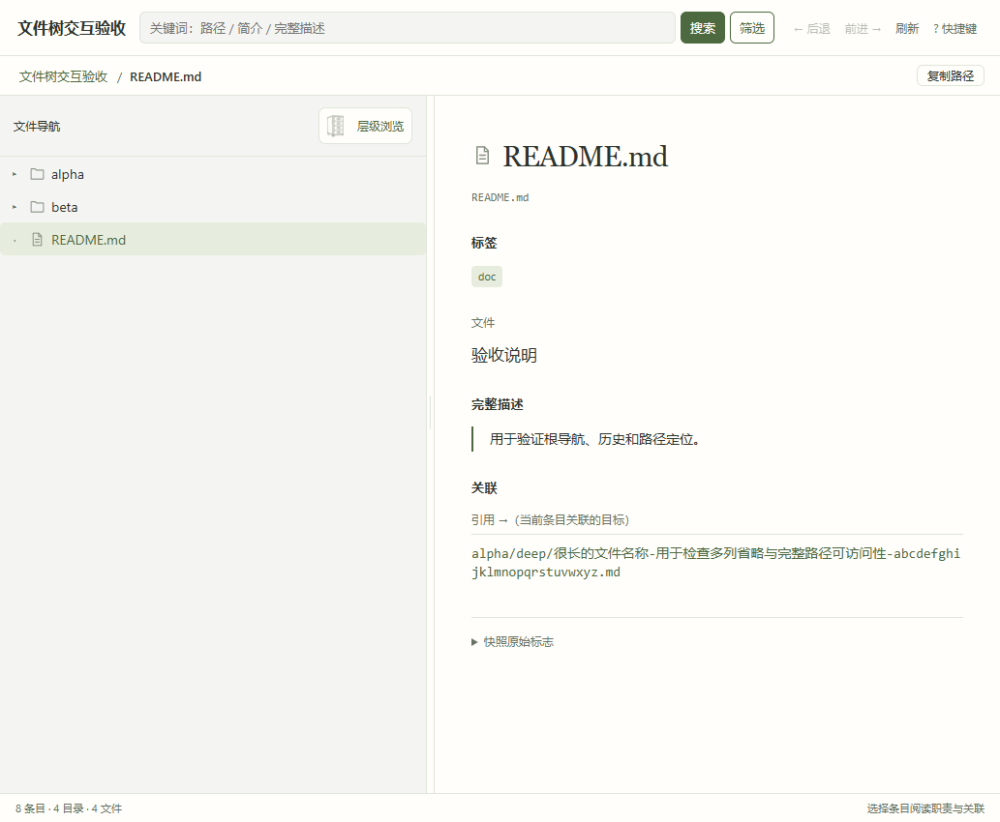
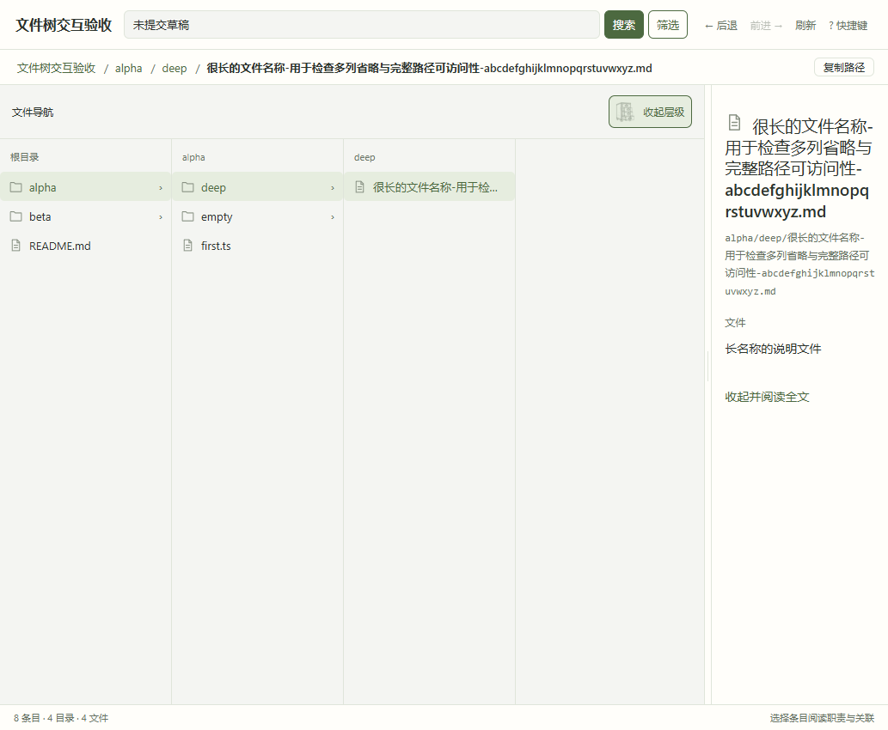
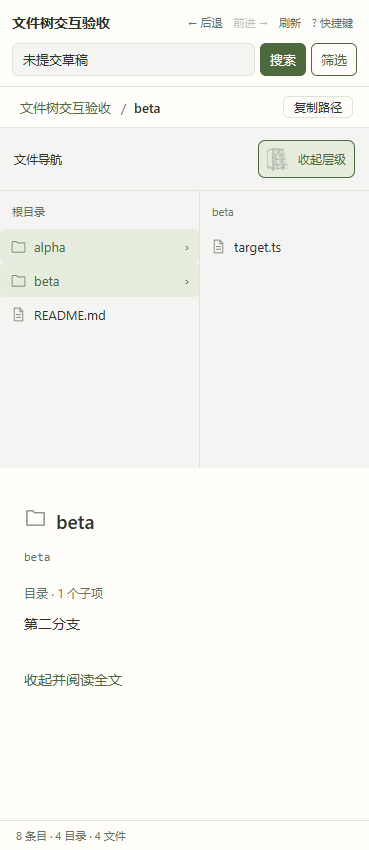
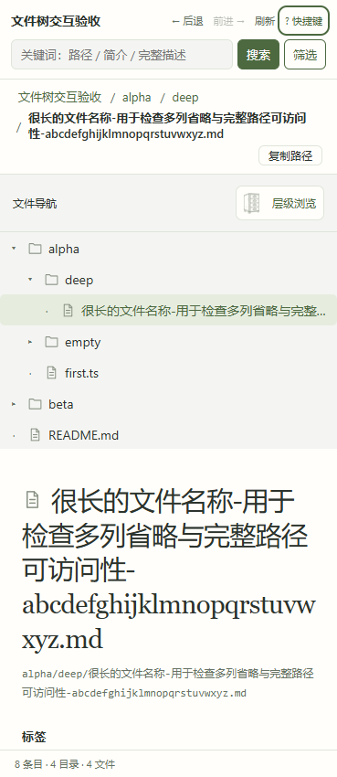

# 文件树 GUI 改造验收

对应规格 #25、实施票 #26–#30。2026-09-12 基于 `4a4943c` 完成阅读布局、限位调宽、抽屉层级浏览及统一导航。所有测试在独立工作树进行，未修改主工作区或紧凑 JSON 契约。

## 环境与范围

- Windows build 26100，16 个逻辑处理器；Python 3.13.9，Node 24.15.0。
- 实际浏览器为 Edge 152.0.4191.66，由 Playwright 驱动；测试真实 Python HTTP 服务与发行静态资源，不以 jsdom 代替几何验证。
- 查看器目标进程使用不包含 Node/npm 的 PATH。自动化宿主本身使用 Node/Playwright，这与目标运行依赖分开。
- 本轮不验证 CentOS 7 原生构建或其他浏览器；旧环境复制 JSON 到现代机的路径保持不变。

## 功能与几何

前端 109 项测试、查看器 123 项测试、部署器 32 项测试，以及 typecheck、build 和文件树严格检查通过。既有虚拟列表测试会输出 React `flushSync` 警告；基线已存在，测试仍通过。

真实浏览器验收覆盖：

- 正文可用宽 W=1024/800/600/360px，分隔条另占9px。普通侧栏最小240px；W=1024时最大440px，W=800时最大368px；W≤600时上下排列，页面无横向溢出。
- 指针拖至两端、松开、pointercancel 后停止调宽；键盘每次10px；临时缩窗再放大恢复用户首选宽度。
- 展开时 W=1024、实际左栏819.1875px（浏览器子像素舍入）；合拢恢复原320px。只有按钮切换模式，展开时分隔条停用。
- 深路径逐列选择、分支裁剪、空目录、键盘上下/Home/End/左右、失败后聚焦重试并按 Enter；长名称和帮助弹层在窄窗仍可访问。
- 搜索第二页开合布局不重新查询，未提交草稿保留；命中定位后返回搜索恢复第二页。根概览进入历史、禁用复制，实际请求中没有根 detail 查询。
- 实际删除选中文件后刷新回退到仍存在的父目录；写入无效测试 JSON 后刷新显示“未刷新”，旧快照仍可浏览；恢复 JSON 后刷新成功。
- 页面入口测试覆盖同代导航乱序、刷新期间改选与新搜索、旧代目录响应、历史404和失败加载恢复。

原始结果见 [几何](gui-redesign-evidence/qa-layout-results.json)、[层级](gui-redesign-evidence/qa-columns-results.json)、[导航](gui-redesign-evidence/qa-navigation-results.json)、[刷新](gui-redesign-evidence/qa-refresh-results.json)。

## 大样本结果

以下为一次浏览器自动化端到端**墙钟耗时**，包含工具调度和渲染等待，不是 CPU 时间，也不是性能承诺。服务已事先读入快照，“初始”仅从页面访问到首批根行出现；“切列”为目录已经缓存在页面内的布局切换，不是冷加载。

| 样本 | 总条目 | 页面初始/ms | 普通树展开/ms | 缓存切列/ms | 树DOM行 | 每列最多DOM行 |
| --- | ---: | ---: | ---: | ---: | ---: | ---: |
| 10k文件 | 11,013 | 129.413 | 59.071 | 25.941 | 31 | 28 |
| 100k文件 | 110,013 | 93.428 | 52.994 | 21.775 | 31 | 28 |
| 单目录100k文件 | 100,001 | 83.978 | 837.053 | 26.765 | 31 | 28 |

视口1440×900。每个场景显示2个列视口，列DOM总数分别41/41/29。高扇出目录仍需一次传输和解析该目录全部直接子项，但虚拟列表不会把十万行全部挂入 DOM。原始数据见 [性能记录](gui-redesign-evidence/qa-performance-results.json)。

10k/100k样本由发行脚本 `gen_viewer_sample.py --files 10000/100000 --out <文件>` 生成；高扇出样本为一个目录内放置十万个带职责描述的文件。样本及构建缓存不入库。

## 离线发行与数据保护

`npm run build` 通过现有组装器生成发行快照，再由部署器同步工作树中的 `.agents/skills/file-tree/`。图标源文件通过 `.gitattributes` 固定为 LF，避免 Windows 换行转换改变资源哈希。重复构建无变化，旧 hash 被清理，构建暂存继续被技能 `.gitignore` 排除。见 [构建校验](gui-redesign-evidence/qa-build-integrity.json)。

临时目标完成真实安装与升级，`tree.json` 和 Git 私有目录中的撤销历史 SHA256 前后相同，见 [部署校验](gui-redesign-evidence/qa-installed-integrity.json)。其 Python 查看器在剥离 Node/npm 的 PATH 下启动，真实浏览器完成“普通树→层级→深层文件→合拢”烟测。旧排版及紧凑 JSON 的只读、升级保护由既有查看器和部署器契约测试覆盖。

实际页面请求仅访问本机的 HTML、JS、CSS、两枚抽屉 SVG 与 API；没有远程字体或 CDN 请求。图标来自已确认的 SVG，透明填充、描边 `#889183`，不重新绘图；36px盒中柜体开合可辨，细线较轻，最终视觉由使用者验收。

## 界面截图

普通阅读布局与关闭抽屉：

80%层级布局与打开抽屉：

窄窗层级与长路径：

